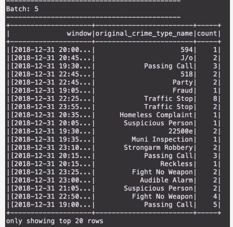
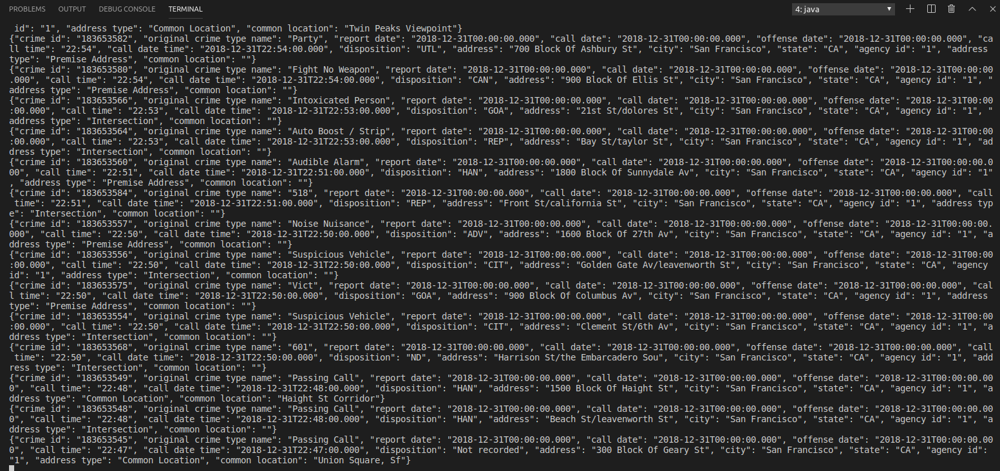
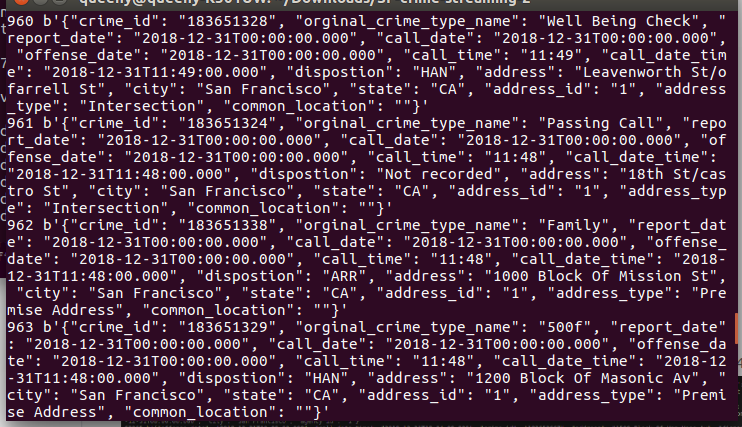

# SF Crime Statistics, Streaming with Spark


## Main Overview

With real world dataset from the kaggle repositories on San Francisco crime incidents, this project uses this data to perform statistical analysis using Apache Spark Structured Streaming. Data is consumed and produced using a Kafka Server through spark structured streaming. Sample output (from the submission) is as below:




### Main Requirements

- Spark 2.4.3
- Scala 2.11.x
- Java 1.8.x
- Kafka build with Scala 2.11.x
- Python 3.6.x or 3.7.x

### How to setup the environment

- Download Spark from https://spark.apache.org/downloads.html. Choose Prebuilt for Apache Hadoop 2.7 and later
- Unpack Spark in one of your folders (I usually put all my dev requirements in /home/users/user/dev)
- Download Scala from the official site or for Mac users, you can also use brew install scala but make sure you download version 2.11.x
- Make sure your ~/.bash_profile looks like below (might be different based on your directory):

```
 export SPARK_HOME=/Users/dev/spark-2.3.0-bin-hadoop2.7
 export JAVA_HOME=/Library/Java/JavaVirtualMachines/jdk1.8.0_181.jdk/Contents/Home
 export SCALA_HOME=/usr/local/scala/
 export PATH=$JAVA_HOME/bin:$SPARK_HOME/bin:$SCALA_HOME/bin:$PATH
```
            

## How project is implemented

Creation of topics as required by this project is done by starting the Zookeeper and Kafka server. The zookeper server is started first followed by the kafka server (order is very important). Below is sample code to be used for starting both servers.


`bin/zookeeper-server-start.sh config/zookeeper.properties`

`bin/kafka-server-start.sh config/server.properties`


- To begin, we get the `data police-department-calls-for-service.csv` and have to convert to `json` format.  

- Our next step was to complete the `data_producer.py` file.

- The server is started by running the following code in working area:

`python data_prodcuer.py`

- Check if the server is correctly implemented by running the command: 

`bin/kafka-console-consumer.sh --bootstrap-server localhost:9092 --topic <your-topic-name> --from-beginning`

We get the following output:



- We create a `data_consumer.py` script to consume data produced from the kafka producer. Running it gets the follwoing results: 



- A spark-submit is finally done using the following command to obain the requried results.

`spark-submit --packages org.apache.spark:spark-sql-kafka-0-10_2.11:2.3.0 --master local[4] data_stream.py`
